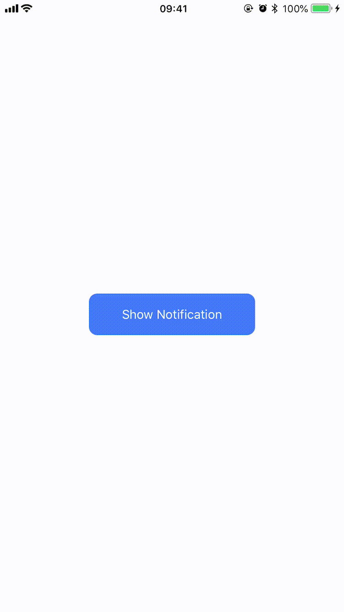

# InAppNotification

<p align="center"> 
	
</p>

## Installation

### CocoaPods

[CocoaPods](http://cocoapods.org) is a dependency manager for Cocoa projects. You can install it with the following command:

```bash
$ gem install cocoapods
```

To integrate InAppNotification into your Xcode project using CocoaPods, specify it in your `Podfile`:

```ruby
source 'https://github.com/CocoaPods/Specs.git'
platform :ios, '10.0'
use_frameworks!

target '<Your Target Name>' do
    pod 'InsideAppNotification'
end
```

Then, run the following command:

```bash
$ pod install
```

## Usage

```swift
import InsideAppNotification
```

```swift
let data: [String: Any] = [
    "conversationID": UUID().uuidString.lowercased()
]

let notification: InAppNotification = InAppNotification(
	picture: #imageLiteral(resourceName: "steve_jobs"), 
	title: "Steve Jobs", 
	subtitle: "I have a new idea I wanna talk to you about", 
	data: data
)

InAppNotificationDispatcher.shared.show(notification: notification) { (_notification) in
    print("Notification Data: \(_notification.data)")
}
```

## License

InAppNotification is released under the MIT license. [See LICENSE](https://github.com/plakolliarnold/InAppNotification/blob/master/LICENSE) for details.